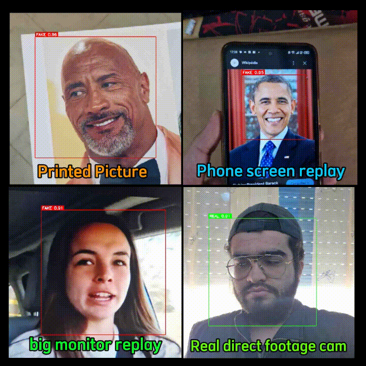
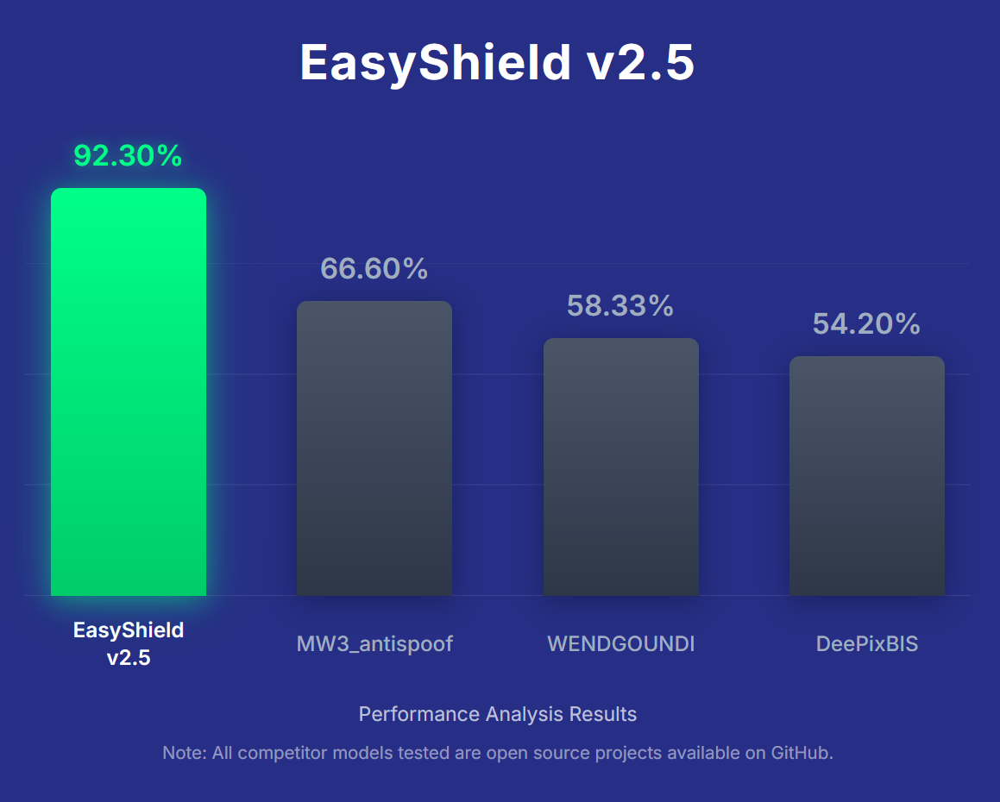

<div align="center">


# EasyShield : A State-of-the-Art Face Anti-Spoofing Deep Learning Model

_optimized for Edge Devices_

[](https://github.com/mahostar/EasyShield-Anti-Spoofing-AI-Model)
[![License](https://img.shields.io/badge/License-MIT-yellow.svg?style=flat&labelColor=gray&logo=data:image/svg+xml;base64,PHN2ZyB4bWxucz0iaHR0cDovL3d3dy53My5vcmcvMjAwMC9zdmciIHZpZXdCb3g9IjAgMCA1NzYgNTEyIj4KICA8cGF0aCBkPSJNMjU2IDMzNmgtLjAyYzAtMTYuMTggMS4zNC04LjczLTg1LjA1LTE4MS41MS0xNy42NS0zNS4yOS02OC4xOS0zNS4zNi04NS44NyAwQy0yLjA2IDMyOC43NS4wMiAzMjAuMzMuMDIgMzM2SDBjMCA0NC4xOCA1Ny4zMSA4MCAxMjggODBzMTI4LTM1LjgyIDEyOC04MHpNMTI4IDE3Nmw3MiAxNDRINTZsNzItMTQ0em01MTEuOTggMTYwYzAtMTYuMTggMS4zNC04LjczLTg1LjA1LTE4MS41MS0xNy42NS0zNS4yOS02OC4xOS0zNS4zNi04NS44NyAwLTg3LjEyIDE3NC4yNi04NS4wNCAxNjUuODQtODUuMDQgMTgxLjUxSDM4NGMwIDQ0LjE4IDU3LjMxIDgwIDEyOCA4MHMxMjgtMzUuODIgMTI4LTgwaC0uMDJ6TTQ0MCAzMjBsNzItMTQ0IDcyIDE0NEg0NDB6bTg4IDEyOEgzNTJWMTUzLjI1YzIzLjUxLTEwLjI5IDQxLjE2LTMxLjQ4IDQ2LjM5LTU3LjI1SDUyOGM4Ljg0IDAgMTYtNy4xNiAxNi0xNlY0OGMwLTguODQtNy4xNi0xNi0xNi0xNkgzODMuNjRDMzY5LjA0IDEyLjY4IDM0Ni4wOSAwIDMyMCAwcy00OS4wNCAxMi42OC02My42NCAzMkgxMTJjLTguODQgMC0xNiA3LjE2LTE2IDE2djMyYzAgOC44NCA3LjE2IDE2IDE2IDE2aDEyOS42MWM1LjIzIDI1Ljc2IDIyLjg3IDQ2Ljk2IDQ2LjM5IDU3LjI1VjQ0OEgxMTJjLTguODQgMC0xNiA3LjE2LTE2IDE2djMyYzAgOC44NCA3LjE2IDE2IDE2IDE2aDQxNmM4Ljg0IDAgMTYtNy4xNiAxNi0xNnYtMzJjMC04Ljg0LTcuMTYtMTYtMTYtMTZ6IiBmaWxsPSJ3aGl0ZSIvPgo8L3N2Zz4%3D&logoColor=white)](https://github.com/mahostar/EasyShield-Anti-Spoofing-AI-Model/blob/main/LICENSE)
[](https://github.com/mahostar/EasyShield-Anti-Spoofing-AI-Model)

</div>

<div align="center">

</div>

<div align="center">

</div>

DeePixBiS : [https://github.com/Saiyam26/Face-Anti-Spoofing-using-DeePixBiS](https://github.com/Saiyam26/Face-Anti-Spoofing-using-DeePixBiS)  
WENDGOUNDI : [https://github.com/WENDGOUNDI/face_anti_spoofing_yolov8](https://github.com/WENDGOUNDI/face_anti_spoofing_yolov8)  
MW3_antispoof : [https://github.com/kprokofi/light-weight-face-anti-spoofing](https://github.com/kprokofi/light-weight-face-anti-spoofing)


## Table of Contents
- [1. Introduction](#1-introduction)
- [2. Features](#2-features)
- [3. System Pipeline Overview](#3-system-pipeline-overview)
- [4. Tools Overview](#4-tools-overview)

- [5. Setup and Installation](#5-setup-and-installation)
  - [5.1. Windows Development Environment Setup](#51-windows-development-environment-setup)
  - [5.2. Linux/Edge Device Setup](#52-linuxedge-device-setup)
- [6. Dataset Workflow](#6-dataset-workflow)
- [7. How to Train a New Model](#7-how-to-train-a-new-model)
- [8. How to Test a Trained Model](#8-how-to-test-a-trained-model)
- [9. Project Structure](#10-project-structure)
- [10. Ethical & Practical Considerations](#11-ethical--practical-considerations)
- [11. Conclusion](#12-conclusion)
- [12. References](#13-references)


## 1. Introduction

Facial‐recognition systems can be tricked by things like printed photos or video replays, putting security at risk. EasyShield v2.5 tackles this head-on, outperforming other leading anti-spoofing methods in tests—catching fake faces with over 92% accuracy and keeping its error rate low.


| Metric                   | EasyShield v2.5 | MN3\_antispoof | DeePixBiS | WENDGOUNDI |
|--------------------------|-----------------|----------------|-----------|------------|
| Accuracy                 | **92.30%**      | 66.60%         | 54.20%    | 58.33%     |
| Precision                | **88.32%**      | 81.74%         | 52.50%    | 55.83%     |
| Recall                   | **97.50%**      | 42.75%         | 88.30%    | 79.75%     |
| F1 Score                 | **92.68%**      | 56.14%         | 65.85%    | 65.68%     |
| AUC                      | **98.61%**      | 81.11%         | 40.29%    | 61.79%     |
| EER                      | **6.25%**       | 27.55%         | 58.37%    | 38.65%     |
| APCER                    | **6.25%**       | 9.55%          | 79.90%    | 57.05%     |
| BPCER                    | **2.50%**       | 57.25%         | 11.70%    | 20.25%     |
| ACER                     | **4.38%**       | 33.40%         | 45.80%    | 38.65%     |
| Avg. Inference Time (ms) | 75.47           | 9.36           | 59.20     | **6.93**   |


*Table 1: Performance Comparison of Anti-Spoofing Models on 8000-Image Test Dataset. EasyShield v2.5 shows superior overall performance.*

## 2. Features
* **Lightweight & Fast**: Runs on edge devices in just ~75 ms per inference.
* **High Accuracy**: Detects print and replay attacks with 92.30% accuracy.
* **Robust Classification**: Clearly labels faces as “Real” or “Fake”.
* **All-in-One Toolkit**: Includes data prep, augmentation, training, and live testing tools.
* **Efficient Architecture**: Built on YOLOv12 nano for optimal performance.

## 3. System Pipeline Overview
EasyShield’s workflow handles everything from gathering and cleaning face images to training its lightweight detection model and rolling it out for live use. User-friendly Python tools (with GUIs when needed) guide you through each stage—from grabbing faces out of photos or videos and beefing up your dataset to building the model and checking its accuracy—so you can go from raw footage to real-time spoof protection in one streamlined process.


<div align="center">

</div>
*Figure 4: Overview of the EasyShield system pipeline from data collection to inference.*

## 4. Tools Overview

- Face Extractor Tool: Extracts faces from images/videos using MTCNN, crops with margin, resizes to 640x640, GUI included.

- Image Augmentor Tool: Applies data augmentations like rotation, blur, brightness, contrast, and flipping to boost dataset diversity.

- Image Filtering Tool: Uses MTCNN to flag/remove low-quality or misaligned face images, helping clean the dataset manually or automatically.

- Dataset Preparation Script: Sorts images into YOLO format with train/valid/test folders and generates dataset.yaml for YOLO training.

- Easy Spoof Trainer Tool: Trains YOLOv12 nano model on prepared dataset with support for tuning hyperparameters and outputs training metrics and best weights.

- Model Testing Tool: Loads trained model in a GUI for real-time or file-based testing, showing Real/Fake predictions with confidence scores.

## 5. Setup and Installation

This section guides you through setting up the EasyShield development environment on both Windows and Linux-based systems, including edge devices.

### 5.1. Windows Development Environment Setup

Setting up the EasyShield development environment on Windows requires careful attention to specific versions of Python, NVIDIA CUDA, NVIDIA cuDNN, and several Python packages.

**Prerequisites:**
*   NVIDIA GPU with CUDA support.
*   Administrator privileges for some installation steps.

**Installation Steps:**
1.  **Install NVIDIA CUDA Toolkit:**
    *   Download and install **CUDA Toolkit 11.8** from the [NVIDIA CUDA Toolkit Archive](https://developer.nvidia.com/cuda-11-8-0-download-archive).

2.  **Install NVIDIA cuDNN:**
    *   Download **cuDNN v8.9.6 for CUDA 11.x** from the [NVIDIA cuDNN Archive](https://developer.nvidia.com/rdp/cudnn-archive). You will need to join the NVIDIA Developer Program (free) to download.

3.  **Create a Python Virtual Environment (Highly Recommended):**
    *   Open a Command Prompt or PowerShell.
    *   Navigate to your project directory (e.g., `cd path\to\EasyShield-Anti-Spoofing-AI-Model`).
    *   Create the virtual environment:
        ```bash
        python -m venv easyshield_env
        ```
    *   Activate the virtual environment:
        ```bash
        easyshield_env\Scripts\activate
        ```
        Your command prompt should now be prefixed with `(easyshield_env)`.

7.  **Install Python Dependencies:**
    *   Ensure pip is up-to-date:
        ```bash
        python -m pip install --upgrade pip
        ```
    *   Install PyTorch (ensure this version matches your CUDA 11.8 setup):
        ```bash
        pip install ultralytics opencv-python numpy PyQt5 torch torchvision torchaudio --extra-index-url https://download.pytorch.org/whl/cu118
        ```
    *   Install FaceNet-PyTorch (without its own PyTorch dependency, as it's already installed):
        ```bash
        pip install facenet-pytorch --no-deps
        ```
    *   Install all other dependencies from the `requirements.txt` file:
        ```bash
        pip install -r requirements.txt
        ```

### 5.2. Linux/Edge Device Setup

Setting up EasyShield on Linux or an edge device (e.g., NVIDIA Jetson, Raspberry Pi - though RPi performance will be limited) involves similar principles but different commands and package considerations.

**Prerequisites:**
*   Python 3.8+ (Python 3.10 recommended).
*   For GPU acceleration on devices like NVIDIA Jetson, ensure NVIDIA JetPack SDK is installed, which includes CUDA, cuDNN, and TensorRT.

**Installation Steps:**

1.  **Install Python (if needed):**
    *   Most Linux distributions come with Python 3. Check with `python3 --version`.
    *   If you need a specific version or it's missing, install it using your distribution's package manager (e.g., `sudo apt update && sudo apt install python3.10 python3.10-venv`).

2.  **Create a Python Virtual Environment (Highly Recommended):**
    *   Open a terminal.
    *   Navigate to your project directory.
    *   Create the virtual environment:
        ```bash
        python3 -m venv easyshield_env
        ```
    *   Activate the virtual environment:
        ```bash
        source easyshield_env/bin/activate
        ```
        Your terminal prompt should now be prefixed with `(easyshield_env)`.

3.  **Install Python Dependencies:**
    *   Ensure pip is up-to-date:
        ```bash
        python -m pip install --upgrade pip
        ```
    *   **Install remaining dependencies** from `requirements_linux.txt`:
        This file should contain packages specific to EasyShield that are not covered by the above, or versions pinned for Linux that differ from the main `requirements.txt`.
        ```bash
        pip install -r requirements_linux.txt
        ```

## 6. Dataset Workflow

The creation of a high-quality dataset is fundamental to the success and robustness of the EasyShield anti-spoofing model. The workflow involves a sequence of steps, each facilitated by specialized tools provided within this project:
* **Data Collection (Manual)**: Collect diverse real and spoofed face data including print and replay attacks under varied conditions.

* **Face Extraction**: Use videos_and_images_face_extractor.py to crop and resize detected faces from collected media into 640x640 images.

* **Image Augmentation**: Use image_augmentor.py to apply transformations like rotation, blur, and brightness to increase dataset diversity.

* **Image Filtering**: Use image_filtring.py with MTCNN to review and clean the dataset by removing misaligned or irrelevant face crops.

* **Dataset Preparation**: Run prepare_data.py to split, organize, and format the dataset into YOLO structure and generate dataset.yaml.

*Figure 6: Example of the dataset structure after preparation, showing 'real' and 'fake' images categorized for training and validation (actual structure may vary based on `prepare_data.py` script).*

## 7. How to Train a New Model

Training a new EasyShield anti-spoofing model involves using the `Easy_Spoof_Trainer.py` tool, which leverages the Ultralytics YOLOv12 framework.

**Prerequisites:**
*   A fully prepared dataset in YOLO format, created using the [Dataset Workflow](#6-dataset-workflow). This includes a `dataset.yaml` file and the corresponding image/label directories.
*   The EasyShield environment correctly set up with all dependencies installed as per Section [5. Setup and Installation](#5-setup-and-installation).

**Steps to Train:**

1.  **Navigate to the Trainer Tool Directory:**
    Open your terminal or command prompt, activate your virtual environment (`easyshield_env`), and change to the directory containing the trainer script:
    ```bash
    cd path/to/EasyShield-Anti-Spoofing-AI-Model/"Trained TOOL for YOLO/"
    ```

2.  **Run the Training Script:**
    Execute `Easy_Spoof_Trainer.py` with appropriate command-line arguments. Here's a basic example:
    ```bash
    python Easy_Spoof_Trainer.py
    ```
3.  **Monitor Training and Results:**
    *   The training progress will be displayed in the terminal, including metrics like loss, accuracy, precision, and recall for each epoch.
    *   Upon completion, the trained model (usually `best.pt` and `last.pt`), along with various performance charts (e.g., confusion matrix, ROC curve) and logs, will be saved in the `runs/train/YourExperimentName/` directory. The `best.pt` model is typically the one with the best validation performance.

## 8. How to Test a Trained Model

- Ensure you have a trained model file like `best.pt` and the EasyShield environment properly set up.

- Navigate to the testing script directory based on your OS:
  * For Windows:
    ```bash
    cd path/to/EasyShield-Anti-Spoofing-AI-Model/"Testing Code (windows)/"
    ```
  * For Linux:
    ```bash
    cd path/to/EasyShield-Anti-Spoofing-AI-Model/"Testing Code (Linux)/"
    ```

- Run the testing script:
  ```bash
  python test_model.py
  ```

## 9. Project Structure

The EasyShield project is organized as follows. This structure ensures that all code, tools, datasets, and documentation are easily accessible.

```plaintext
EasyShield-Anti-Spoofing-AI-Model/
├── Dataset_Demo_Exemple/             # Example dataset with 'fake' and 'real' subdirectories
│   ├── fake/
│   │   └── (image files: .jpg, .png, etc.)
│   └── real/
│       └── (image files: .jpg, .png, etc.)
├── EasyShield weights/                 # Contains pre-trained model weights
│   ├── EasyShield V2.5 - nano (well mixed dataset) 120 epochs 16 batch/ # Latest recommended version
│   │   └── best.pt                     # Example of a trained model file
│   └── old versions (less acurate - less performence)/                 # Older model versions for reference
│       └── (similar structure with .pt files)
├── Original YOLO v12 Models For training/ # Base YOLO models (Note: Project primarily uses YOLOv12, this dir might be for experimentation or legacy)
│   └── (YOLO model files like .pt or .yaml)
├── Testing Code (Linux)/               # Model testing scripts optimized or specific to Linux environments
│   └── test_model.py                   # GUI-based model testing script
├── Testing Code (windows)/             # Model testing scripts optimized or specific to Windows environments
│   └── test_model.py                   # GUI-based model testing script
├── Trained TOOL for YOLO/              # Core training script for the EasyShield model
│   └── Easy_Spoof_Trainer.py           # Python script to train the YOLOv12 model
├── dataset preparing tools/            # Suite of tools for dataset creation, augmentation, and management
│   ├── data_collection.py              # (Potentially) Script for initial data gathering or organization (if used)
│   ├── image_augmentor.py              # Tool for applying data augmentation techniques
│   ├── image_filtring.py               # Tool for manual dataset review and filtering (with MTCNN assistance)
│   ├── prepare_data.py                 # Script to format the dataset for YOLO training and generate dataset.yaml
│   └── videos_and_images_face_extractor.py # Tool to extract faces from videos and images
├── README.md                           # This comprehensive documentation file
├── requirements.txt                    # Python package dependencies for Windows and general use
└── requirements_linux.txt              # Python package dependencies tailored for Linux/edge device setups
```

## 10. Ethical & Practical Considerations

While EasyShield offers significant advancements in face anti-spoofing, it is crucial to consider the ethical implications and practical limitations inherent in such technology. Responsible development and deployment are paramount.

1.  **Bias and Fairness:**
    *   Deep learning models can inadvertently learn and perpetuate biases present in their training data. If the dataset is not sufficiently diverse (e.g., in terms of age, gender, ethnicity, skin tone, and environmental conditions like lighting), the model's performance may vary significantly across different user groups. This can lead to some groups being more susceptible to false positives or false negatives.
    *   **Mitigation:** Continuous efforts are needed to curate balanced, representative datasets and to test for and mitigate bias in model performance.

2.  **Privacy:**
    *   The collection, storage, and use of facial data are subject to stringent privacy regulations (e.g., GDPR, CCPA) and ethical guidelines. Facial images are considered sensitive personal information.
    *   **Mitigation:** Systems using EasyShield must ensure user consent is obtained where required, data is anonymized or pseudonymized if possible, stored securely, and processed only for the intended purposes. Transparency with users about data handling practices is essential.

## 11. Conclusion

EasyShield is a lightweight face anti-spoofing system designed for edge devices. It combines a compact YOLOv12 nano model with a full pipeline for data preparation, training, and testing. It outperforms many existing methods in key performance areas. The included tools cover the whole process from data collection to real-time evaluation, making it easy to develop and improve the system.

## 12. References

The development of EasyShield and the information presented in this document draw upon knowledge from various sources in the fields of machine learning, computer vision, and face anti-spoofing. Key resources and technologies include:

*   **Ultralytics YOLOv12:** The core object detection and classification framework used. [https://github.com/ultralytics/ultralytics](https://github.com/ultralytics/ultralytics)
*   **PyTorch:** The deep learning framework used by YOLOv12 and for model development. [https://pytorch.org/](https://pytorch.org/)
*   **MTCNN (Multi-task Cascaded Convolutional Networks):** Often used for face detection. A popular implementation can be found at [https://github.com/ipazc/mtcnn](https://github.com/ipazc/mtcnn) (though the specific face detector in the tools may vary).
*   **Face Recognition and Anti-Spoofing Research:**
    *   Rosebrock, A. (2021). *PyImageSearch Gurus course*. PyImageSearch. (General computer vision and deep learning resource).
    *   **CelebA-Spoof Dataset:** A large-scale face anti-spoofing dataset. Zhang, Y., et al. (2020). CelebA-Spoof: Large-Scale CelebFace Anti-Spoofing Dataset with Rich Annotations. [https://github.com/Davidzhangyuanhan/CelebA-Spoof](https://github.com/Davidzhangyuanhan/CelebA-Spoof)
