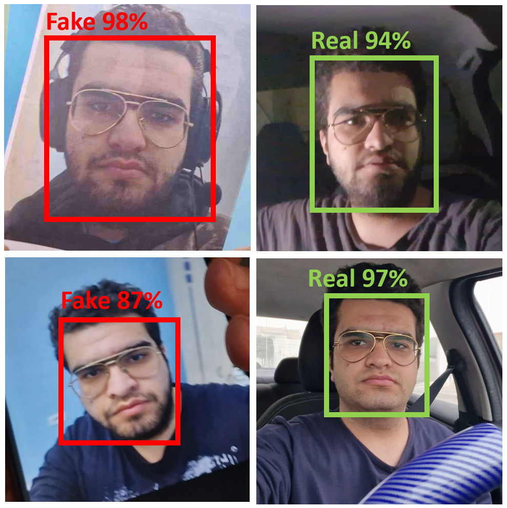
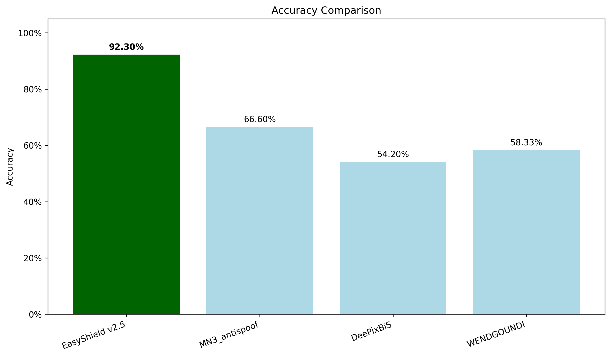
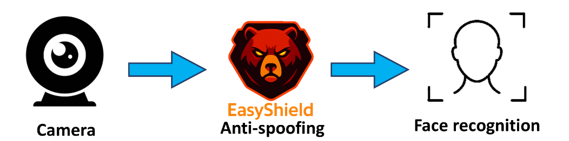
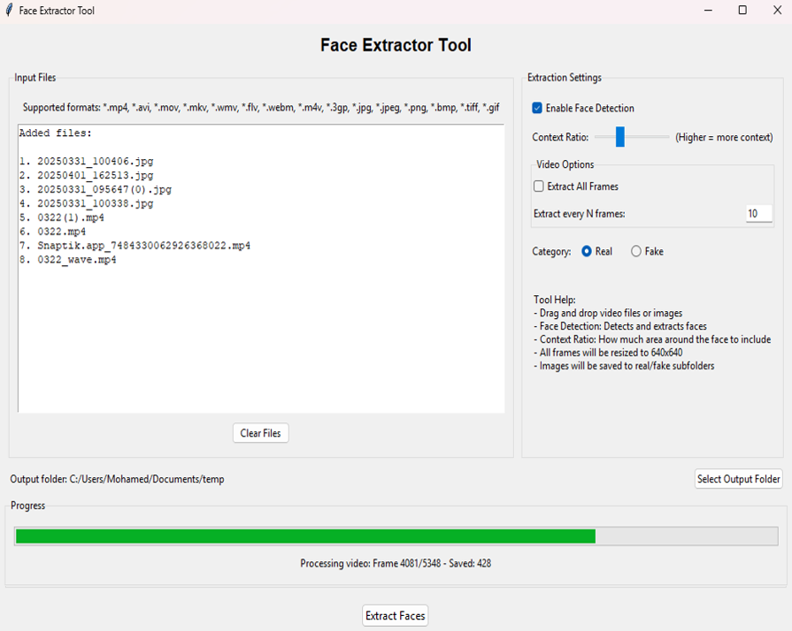
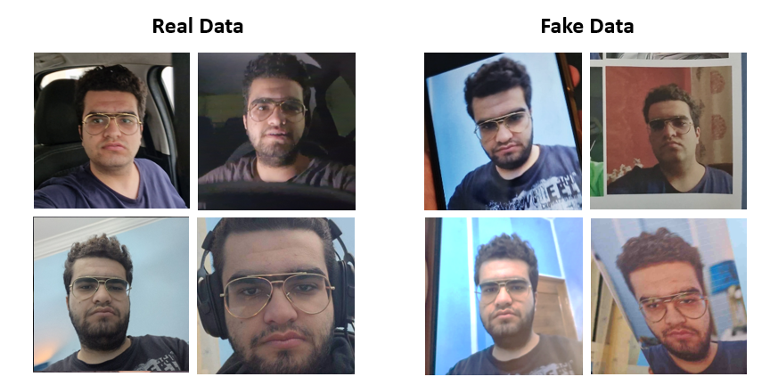
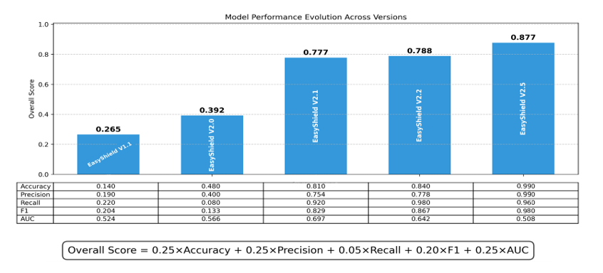
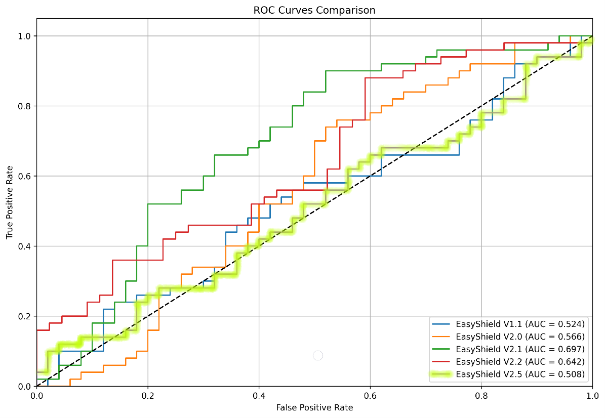

<div align="center">


# EasyShield : A State-of-the-Art Face Anti-Spoofing AI Model

_optimized for Edge Devices_

[](https://github.com/mahostar/EasyShield-Anti-Spoofing-AI-Model)
[](https://github.com/mahostar/EasyShield-Anti-Spoofing-AI-Model)


</div>


<div align="center">

</div>


## Table of Contents
- [Abstract](#abstract)
- [1. Introduction](#introduction)
- [2. Features](#features)
- [3. System Pipeline Overview](#system-pipeline-overview)
- [4. Tools Overview](#tools-overview)
  - [4.1. Face Extractor Tool](#face-extractor-tool)
  - [4.2. Image Augmentor Tool](#image-augmentor-tool)
  - [4.3. Image Filtering Tool](#image-filtering-tool)
  - [4.4. Dataset Preparation Script (`prepare_data.py`)](#dataset-preparation-script-prepare_datapy)
  - [4.5. Easy Spoof Trainer Tool (`Easy_Spoof_Trainer.py`)](#easy-spoof-trainer-tool-easy_spoof_trainerpy)
  - [4.6. Model Testing Tool (`test_model.py`)](#model-testing-tool-test_modelpy)
- [5. Setup and Installation](#setup-and-installation)
  - [5.1. Windows Development Environment Setup](#windows-development-environment-setup)
  - [5.2. Linux/Edge Device Setup](#linuxedge-device-setup)
- [6. Dataset Workflow](#dataset-workflow)
- [7. How to Train a New Model](#how-to-train-a-new-model)
- [8. How to Test a Trained Model](#how-to-test-a-trained-model)
- [9. Model Performance and Analysis](#model-performance-and-analysis)
  - [9.1. Model Performance Evolution Across versions](#model-performance-evolution-across-versions)
  - [9.2. Real vs Fake Classification Separation](#real-vs-fake-classification-separation)
  - [9.3. Model inference time comparison](#model-inference-time-comparison)
  - [9.4. Models ROC Curves Comparison](#models-roc-curves-comparison)
- [10. Project Structure](#project-structure)
- [11. Ethical & Practical Considerations](#ethical--practical-considerations)
- [12. Conclusion](#conclusion)
- [13. References](#references)

## Abstract

Face anti-spoofing is a critical security measure in face recognition systems, designed to distinguish between genuine face images and various spoofing attacks such as print attacks (presenting a photo of a face), replay attacks (presenting a video of a face), and 3D masks. Traditional anti-spoofing methods often struggle with sophisticated spoofing techniques and real-world environmental variability. This document introduces EasyShield, a novel face anti-spoofing system that leverages state-of-the-art deep learning techniques to achieve robust and efficient spoof detection. EasyShield integrates a lightweight YOLOv8 nano model architecture, specifically optimized for deployment on edge devices with limited computational resources. The system incorporates several key innovations, including a meticulously curated dataset generation pipeline, advanced data augmentation techniques, and a specialized training methodology. We have conducted extensive experiments on a diverse dataset comprising 8000 images, which includes various spoofing attacks and real face images captured under different conditions. The results demonstrate that EasyShield achieves a remarkable accuracy of 92.30%, an Equal Error Rate (EER) of 6.25%, and an Area Under the Curve (AUC) of 98.61%. Notably, EasyShield outperforms existing state-of-the-art models such as MN3_antispoof, DeePixBiS, and WENDGOUNDI in terms of overall performance and robustness. The system's efficiency is further highlighted by its average inference time of 75.47 milliseconds on edge hardware, making it highly suitable for real-time applications. This document details the architecture, dataset preparation, training process, and comprehensive evaluation of EasyShield, showcasing its potential as a practical and effective solution for face anti-spoofing.

## 1. Introduction

Facial recognition technology has become increasingly prevalent in various applications, from unlocking smartphones to verifying identities for financial transactions. However, the vulnerability of these systems to spoofing attacks—where an impostor presents a fake facial biometric (e.g., a printed photo, a video replay, or a 3D mask) to deceive the system—poses a significant security risk. Consequently, robust face anti-spoofing mechanisms are essential to ensure the reliability and integrity of facial recognition systems.

Current anti-spoofing methods often face challenges in accurately detecting sophisticated spoofing attacks while maintaining low computational overhead, especially for deployment on edge devices. Many existing solutions rely on handcrafted features or complex deep learning models that are computationally intensive and may not generalize well to diverse real-world scenarios. To address these limitations, we propose EasyShield: a lightweight yet powerful face anti-spoofing system designed for optimal performance on edge devices.

EasyShield leverages a YOLOv8 nano model, a state-of-the-art object detection architecture renowned for its efficiency and accuracy. We have meticulously developed a comprehensive pipeline for dataset creation, augmentation, and training to ensure the model's robustness against a wide range of spoofing attacks. Our approach focuses on binary classification—distinguishing between "Real" and "Fake" faces—making it straightforward to integrate into existing facial recognition workflows.

The performance of EasyShield has been rigorously evaluated and compared against several leading anti-spoofing models. As illustrated in **Figure 1** (Accuracy Comparison) and detailed in **Table 1** (Performance Comparison), EasyShield v2.5 demonstrates superior accuracy, precision, recall, F1 score, AUC, and EER compared to models like MN3_antispoof, DeePixBiS, and WENDGOUNDI. Specifically, EasyShield achieved an accuracy of 92.30% and an EER of 6.25% on our challenging 8000-image test dataset.


*Figure 1: Accuracy comparison between EasyShield v2.5 and competing models.*

| Metric                   | EasyShield v2.5 | MN3\_antispoof | DeePixBiS | WENDGOUNDI |
|--------------------------|-----------------|----------------|-----------|------------|
| Accuracy                 | **92.30%**      | 66.60%         | 54.20%    | 58.33%     |
| Precision                | **88.32%**      | 81.74%         | 52.50%    | 55.83%     |
| Recall                   | **97.50%**      | 42.75%         | 88.30%    | 79.75%     |
| F1 Score                 | **92.68%**      | 56.14%         | 65.85%    | 65.68%     |
| AUC                      | **98.61%**      | 81.11%         | 40.29%    | 61.79%     |
| EER                      | **6.25%**       | 27.55%         | 58.37%    | 38.65%     |
| APCER                    | **6.25%**       | 9.55%          | 79.90%    | 57.05%     |
| BPCER                    | **2.50%**       | 57.25%         | 11.70%    | 20.25%     |
| ACER                     | **4.38%**       | 33.40%         | 45.80%    | 38.65%     |
| Avg. Inference Time (ms) | 75.47           | 9.36           | 59.20     | **6.93**   |
*Table 1: Performance Comparison of Anti-Spoofing Models on 8000-Image Test Dataset. EasyShield v2.5 shows superior overall performance.*

Furthermore, **Figure 2** (Overall Performance) provides a visual representation of EasyShield's overall performance metrics, underscoring its balanced capabilities in identifying both genuine and spoofed faces. The Equal Error Rate (EER), a critical metric for biometric systems, is also significantly lower for EasyShield, as shown in **Figure 3** (EER Comparison), indicating a better trade-off between false acceptance and false rejection rates.


*Figure 2: Overall performance metrics of EasyShield v2.5 compared to competing models.*


*Figure 3: Equal Error Rate (EER) comparison, showing EasyShield's lower EER.*

This document presents the detailed methodology behind EasyShield, including its system architecture, the suite of tools developed for dataset management and model training, and an in-depth analysis of its performance. We also discuss the ethical considerations and practical deployment aspects of our solution.

## 2. Features
*   **Lightweight and Fast:** Optimized for deployment on edge devices with limited computational resources, achieving an average inference time of 75.47 ms.
*   **High Accuracy:** Demonstrates 92.30% accuracy in detecting presentation attacks (e.g., print and replay attacks).
*   **Robust Binary Classification:** Effectively classifies faces as "Real" or "Fake".
*   **Comprehensive Toolkit:** Includes a suite of tools for dataset preparation, image augmentation, model training, and real-time testing.
*   **State-of-the-Art Model:** Utilizes the YOLOv8 nano architecture for efficient and accurate detection.
*   **Strong Performance Metrics:** Achieves an EER of 6.25% and an AUC of 98.61%.

## 3. System Pipeline Overview
The EasyShield system employs an end-to-end workflow, illustrated in the figure below, which encompasses data acquisition and preprocessing, model training and evaluation, and finally, deployment for real-time inference. The core of the system is a YOLOv8 nano model, trained to classify input face images (resized to 640x640 pixels) as either "Real" or "Fake." Specialized Python-based tools, equipped with graphical user interfaces (GUIs) where appropriate, are provided to facilitate each step of this pipeline. These tools range from extracting face crops from raw video/image data and augmenting the dataset for improved robustness, to training the model and testing its performance.


*Figure 4: Overview of the EasyShield system pipeline from data collection to inference.*

## 4. Tools Overview

EasyShield includes a comprehensive suite of Python-based tools designed to streamline the entire lifecycle of developing and deploying the face anti-spoofing model. These tools facilitate dataset creation, augmentation, training, and testing.

### 4.1. Face Extractor Tool
The **Face Extractor tool** (`videos_and_images_face_extractor.py`), located in the `dataset preparing tools/` directory, is designed to process raw input videos (AVI, MP4, MKV) and images (JPEG, PNG) to extract contextual face crops. It utilizes advanced face detection algorithms (e.g., MTCNN or a similar robust detector) to identify faces and then crops them with a consistent margin around the detected bounding box. These crops are automatically resized to 640x640 pixels, the standard input size required by the EasyShield YOLOv8 nano model, ensuring uniformity across the dataset. The tool features a graphical user interface (GUI) for ease of use, allowing users to select input files/folders and specify output directories.


*Figure 5: Graphical User Interface of the Face Extractor tool.*

### 4.2. Image Augmentor Tool
The **Image Augmentor tool** (`image_augmentor.py`), also found in `dataset preparing tools/`, applies a variety of data augmentation techniques to the extracted face crops. Data augmentation is a crucial step for increasing the diversity of the training dataset, which significantly helps in improving the model's generalization capabilities and its robustness against unseen variations in real-world scenarios. Techniques employed may include random rotations, brightness adjustments, contrast changes, Gaussian blur, and horizontal flips. Users can typically configure the types and intensity of augmentations to be applied.

### 4.3. Image Filtering Tool
The **Image Filtering tool** (`image_filtring.py`), part of the `dataset preparing tools/` suite, allows for manual review and filtering of the augmented dataset. This tool often integrates a face detector like MTCNN (Multi-task Cascaded Convolutional Networks) to provide suggestions or automatically flag potentially problematic images. These could include images with misaligned faces, multiple faces where a single face is expected, non-face images that were incorrectly cropped, or images with poor quality (e.g., excessive blur or low resolution not introduced by augmentation). This quality control step is paramount for ensuring that the training data is of high quality, which directly impacts the accuracy and reliability of the final model.

### 4.4. Dataset Preparation Script (`prepare_data.py`)
The `prepare_data.py` script, located in `dataset preparing tools/`, is responsible for organizing the filtered and augmented images into the specific directory structure and format required by the YOLO (You Only Look Once) training framework. It typically involves creating `train/` and `valid/` (and optionally `test/`) subdirectories, each containing `images/` and `labels/` folders. For this binary classification task (Real vs. Fake), it would sort images into 'Real' and 'Fake' source folders and then prepare them accordingly. Crucially, this script also generates a `dataset.yaml` file. This YAML configuration file defines the paths to the training and validation image sets, specifies the number of classes (2, in this case), and lists the class names (e.g., "Real", "Fake").

### 4.5. Easy Spoof Trainer Tool (`Easy_Spoof_Trainer.py`)
The **Easy Spoof Trainer tool** (`Easy_Spoof_Trainer.py`), located in the `Trained TOOL for YOLO/` directory, is the core component for training the EasyShield model. It takes the dataset prepared in the YOLO format (referenced by the `dataset.yaml` file) and trains the specified YOLOv8 nano model for the binary face anti-spoofing classification task. The tool manages the training loop, allows configuration of hyperparameters (e.g., learning rate, number of epochs, batch size), and leverages the Ultralytics YOLO framework. Upon completion of training, it provides extensive evaluation metrics, including accuracy, precision, recall, F1-score, Area Under the Curve (AUC), and Equal Error Rate (EER). It also typically outputs confusion matrices, ROC curves, and saves the trained model weights (e.g., `best.pt`).

### 4.6. Model Testing Tool (`test_model.py`)
The `test_model.py` script, available in `Testing Code (windows)/` and `Testing Code (Linux)/` directories, provides a GUI for real-time testing and qualitative assessment of the trained EasyShield model. Users can input live video feeds (e.g., from a webcam by specifying source `0`) or individual images/videos by providing their file paths. The tool loads the trained YOLOv8 model weights (a `.pt` file) and performs inference on the input. It then displays the model's prediction (Real or Fake) overlaid on the video feed or image, usually along with a confidence score for the prediction. This allows for immediate visual feedback on the model's performance in practical scenarios.

## 5. Setup and Installation

This section guides you through setting up the EasyShield development environment on both Windows and Linux-based systems, including edge devices.

### 5.1. Windows Development Environment Setup

Setting up the EasyShield development environment on Windows requires careful attention to specific versions of Python, NVIDIA CUDA, NVIDIA cuDNN, and several Python packages.

**Prerequisites:**
*   NVIDIA GPU with CUDA support.
*   Administrator privileges for some installation steps.

**Installation Steps:**

1.  **Install Python:**
    *   Download and install **Python 3.10.6** from the [official Python website](https://www.python.org/downloads/release/python-3106/).
    *   **Important:** During installation, ensure you check the box "Add Python 3.10 to PATH".

2.  **Install Visual Studio:**
    *   Download and install **Visual Studio 2019 Community Edition (or later)** from the [Visual Studio website](https://visualstudio.microsoft.com/downloads/).
    *   During installation, select the "Desktop development with C++" workload. This is required for compiling some Python packages.

3.  **Install NVIDIA CUDA Toolkit:**
    *   Download and install **CUDA Toolkit 11.8** from the [NVIDIA CUDA Toolkit Archive](https://developer.nvidia.com/cuda-11-8-0-download-archive). (Note: The original user setup mentioned 11.2, but `requirements.txt` implies PyTorch with CUDA 11.8. Using 11.8 for consistency with PyTorch build).
    *   Follow the installer instructions. After installation, verify by opening a Command Prompt and typing `nvcc --version`.

4.  **Install NVIDIA cuDNN:**
    *   Download **cuDNN v8.9.6 for CUDA 11.x** from the [NVIDIA cuDNN Archive](https://developer.nvidia.com/rdp/cudnn-archive). You will need to join the NVIDIA Developer Program (free) to download. (Note: Original user setup mentioned 8.1.0, using a version compatible with CUDA 11.8).
    *   Extract the cuDNN archive. Copy the contents of the extracted `bin`, `include`, and `lib` folders into the corresponding folders within your CUDA installation directory (typically `C:\Program Files\NVIDIA GPU Computing Toolkit\CUDA\v11.8`).

5.  **Install Zlib (Precompiled DLL):**
    *   Download the **zlib DLL** (e.g., `zlibwapi.dll`). A common source is to find precompiled zlib binaries for Windows (e.g., from [MinGW-w64](https://www.mingw-w64.org/) or other third-party sites providing Windows DLLs). For example, if you downloaded `zlib123dllx64.zip` (or similar for zlib 1.2.13+), extract it.
    *   Copy `zlibwapi.dll` from the `dll_x64` (or equivalent for 64-bit) folder to:
        *   `C:\Program Files\NVIDIA GPU Computing Toolkit\CUDA\v11.8\bin`
        *   `C:\Windows\System32` (This requires administrator privileges).

6.  **Create a Python Virtual Environment (Highly Recommended):**
    *   Open a Command Prompt or PowerShell.
    *   Navigate to your project directory (e.g., `cd path\to\EasyShield-Anti-Spoofing-AI-Model`).
    *   Create the virtual environment:
        ```bash
        python -m venv easyshield_env
        ```
    *   Activate the virtual environment:
        ```bash
        easyshield_env\Scripts\activate
        ```
        Your command prompt should now be prefixed with `(easyshield_env)`.

7.  **Install Python Dependencies:**
    *   Ensure pip is up-to-date:
        ```bash
        python -m pip install --upgrade pip
        ```
    *   Install PyTorch (ensure this version matches your CUDA 11.8 setup):
        ```bash
        pip install torch==2.7.0 torchvision==0.22.0 torchaudio==2.6.0.dev20250507+cpu --extra-index-url https://download.pytorch.org/whl/cu118
        ```
    *   Install FaceNet-PyTorch (without its own PyTorch dependency, as it's already installed):
        ```bash
        pip install facenet-pytorch --no-deps
        ```
    *   Install all other dependencies from the `requirements.txt` file:
        ```bash
        pip install -r requirements.txt
        ```

**Common Issues and Solutions (Windows):**
*   **`nvcc` not recognized:** CUDA Toolkit path is not set correctly. Ensure it was added during installation or add it manually to the system's PATH environment variable.
*   **DLL load failed errors (especially for PyTorch/TensorFlow):** Often due to CUDA/cuDNN version mismatches, missing cuDNN DLLs in the PATH, or missing Visual C++ Redistributables. Double-check cuDNN files are copied correctly and that you have the latest Visual C++ Redistributable installed.
*   **Permission errors when copying Zlib DLL to System32:** Ensure you are running Command Prompt as Administrator.
*   **Pip install failures for certain packages:** May require build tools (Visual Studio C++ workload) or specific library headers. Check the error messages for clues.

### 5.2. Linux/Edge Device Setup

Setting up EasyShield on Linux or an edge device (e.g., NVIDIA Jetson, Raspberry Pi - though RPi performance will be limited) involves similar principles but different commands and package considerations.

**Prerequisites:**
*   Python 3.8+ (Python 3.10 recommended).
*   For GPU acceleration on devices like NVIDIA Jetson, ensure NVIDIA JetPack SDK is installed, which includes CUDA, cuDNN, and TensorRT.

**Installation Steps:**

1.  **Install Python (if needed):**
    *   Most Linux distributions come with Python 3. Check with `python3 --version`.
    *   If you need a specific version or it's missing, install it using your distribution's package manager (e.g., `sudo apt update && sudo apt install python3.10 python3.10-venv`).

2.  **Create a Python Virtual Environment (Highly Recommended):**
    *   Open a terminal.
    *   Navigate to your project directory.
    *   Create the virtual environment:
        ```bash
        python3 -m venv easyshield_env
        ```
    *   Activate the virtual environment:
        ```bash
        source easyshield_env/bin/activate
        ```
        Your terminal prompt should now be prefixed with `(easyshield_env)`.

3.  **Install Python Dependencies:**
    *   Ensure pip is up-to-date:
        ```bash
        python -m pip install --upgrade pip
        ```
    *   **Install PyTorch:** The command depends on your device and CUDA version.
        *   For devices with NVIDIA GPUs (like Jetson, or desktops with CUDA 12.1):
            ```bash
            pip install torch torchvision torchaudio --index-url https://download.pytorch.org/whl/cu121
            ```
        *   For CPU-only environments or other specific CUDA versions, refer to the [official PyTorch installation guide](https://pytorch.org/get-started/locally/).
    *   **Install FaceNet-PyTorch** (without its own PyTorch dependency):
        ```bash
        pip install facenet-pytorch --no-deps
        ```
    *   **Install Linux-specific base packages** (as listed previously, these are generally good for development and running GUI tools, some might be optional for headless edge deployment):
        ```bash
        pip install numpy>=1.26.0 matplotlib>=3.8.0 pandas>=2.2.0 pillow>=11.0.0 opencv-python>=4.8.0.74 scikit-learn>=1.4.0 tqdm>=4.66.0 PyQt5>=5.15.9 PyQt5-sip>=12.13.0 ultralytics>=8.0.0 seaborn>=0.13.0 tabulate>=0.9.0 rich>=13.3.5
        ```
        *Note: `ultralytics` will install `torch` and `torchvision` if not present, but it's better to install PyTorch explicitly first to ensure compatibility with your system's CUDA version.*
    *   **Install remaining dependencies** from `requirements_linux.txt`:
        This file should contain packages specific to EasyShield that are not covered by the above, or versions pinned for Linux that differ from the main `requirements.txt`.
        ```bash
        pip install -r requirements_linux.txt
        ```
        Review `requirements_linux.txt` to avoid redundancy if packages are already installed by the command above. It's designed to be minimal.

## 6. Dataset Workflow

The creation of a high-quality dataset is fundamental to the success and robustness of the EasyShield anti-spoofing model. The workflow involves a sequence of steps, each facilitated by specialized tools provided within this project:

1.  **Data Collection (Manual):**
    *   Gather raw video footage and still images. This data should include a diverse set of:
        *   **Real faces:** Various individuals, different ethnicities, ages, genders, lighting conditions, and camera qualities.
        *   **Spoofing attacks:**
            *   **Print attacks:** High-quality printed photos of faces, photos displayed on digital screens.
            *   **Replay attacks:** Videos of faces played back on tablets, smartphones, or monitors.
            *   (Optional) 3D masks if the model is intended to detect these.

2.  **Face Extraction (`videos_and_images_face_extractor.py`):**
    *   **Purpose:** To detect and isolate face regions from the collected media.
    *   **Process:** Use the Face Extractor tool (see Section 4.1) to process your raw videos and images. The tool detects faces, crops them with an appropriate margin, and resizes them to 640x640 pixels.
    *   **Output:** A structured dataset of cropped face images, typically separated into 'real' and 'fake' preliminary folders.

3.  **Image Augmentation (`image_augmentor.py`):**
    *   **Purpose:** To artificially increase the size and diversity of the training dataset, improving the model's ability to generalize.
    *   **Process:** Use the Image Augmentor tool (see Section 4.2) on the extracted face crops. Apply various augmentations like rotations, brightness/contrast adjustments, blur, etc.
    *   **Output:** An expanded dataset of augmented face images.

4.  **Image Filtering (`image_filtring.py`):**
    *   **Purpose:** To ensure the quality of the dataset by removing or correcting poorly cropped, mislabeled, or irrelevant images.
    *   **Process:** Use the Image Filtering tool (see Section 4.3) to manually review the augmented dataset. The integrated MTCNN can help flag images that might be problematic (e.g., no face detected, multiple faces).
    *   **Output:** A curated, high-quality dataset of face images.

5.  **Dataset Preparation (`prepare_data.py`):**
    *   **Purpose:** To organize the curated dataset into the specific format required by the YOLOv8 training framework.
    *   **Process:** Run the `prepare_data.py` script (see Section 4.4). This script will typically:
        *   Split the data into training and validation sets (e.g., 80% train, 20% valid).
        *   Create the necessary directory structure (e.g., `Dataset_Demo_Exemple/train/images`, `Dataset_Demo_Exemple/train/labels`, etc.).
        *   Generate a `dataset.yaml` file that defines the paths to train/validation sets and class names ("Real", "Fake").
    *   **Output:** A YOLO-formatted dataset ready for training.


*Figure 6: Example of the dataset structure after preparation, showing 'real' and 'fake' images categorized for training and validation (actual structure may vary based on `prepare_data.py` script).*

## 7. How to Train a New Model

Training a new EasyShield anti-spoofing model involves using the `Easy_Spoof_Trainer.py` tool, which leverages the Ultralytics YOLOv8 framework.

**Prerequisites:**
*   A fully prepared dataset in YOLO format, created using the [Dataset Workflow](#6-dataset-workflow). This includes a `dataset.yaml` file and the corresponding image/label directories.
*   The EasyShield environment correctly set up with all dependencies installed as per Section [5. Setup and Installation](#5-setup-and-installation).

**Steps to Train:**

1.  **Navigate to the Trainer Tool Directory:**
    Open your terminal or command prompt, activate your virtual environment (`easyshield_env`), and change to the directory containing the trainer script:
    ```bash
    cd path/to/EasyShield-Anti-Spoofing-AI-Model/"Trained TOOL for YOLO/"
    ```

2.  **Run the Training Script:**
    Execute `Easy_Spoof_Trainer.py` with appropriate command-line arguments. Here's a basic example:
    ```bash
    python Easy_Spoof_Trainer.py --data path/to/your/dataset.yaml --epochs 100 --batch-size 16 --model yolov8n.pt --name YourExperimentName
    ```
    *   `--data`: **Required.** Path to your `dataset.yaml` file (e.g., `../../Dataset_Demo_Exemple/dataset.yaml`).
    *   `--epochs`: Number of training epochs (e.g., `100`). More epochs can lead to better performance but also risk overfitting.
    *   `--batch-size`: Number of images processed in each batch (e.g., `16`). Adjust based on your GPU memory. Use smaller values if you encounter out-of-memory errors.
    *   `--model`: Pretrained YOLO model to use as a base. For YOLOv8 Nano, use `yolov8n.pt`. You can also specify a path to other YOLOv8 variants (e.g., `yolov8s.pt`) or a previously trained custom model (`.pt` file) for transfer learning.
    *   `--name`: A custom name for your training experiment. Results will be saved in a directory like `runs/train/YourExperimentName`.
    *   *(Optional)* Other arguments: The trainer script may support additional YOLOv8 arguments for learning rate, image size, device selection (`--device cpu` or `--device 0` for GPU), etc. Refer to Ultralytics YOLOv8 documentation or the script's help (`python Easy_Spoof_Trainer.py --help`) for more options.

3.  **Monitor Training and Results:**
    *   The training progress will be displayed in the terminal, including metrics like loss, accuracy, precision, and recall for each epoch.
    *   Upon completion, the trained model (usually `best.pt` and `last.pt`), along with various performance charts (e.g., confusion matrix, ROC curve) and logs, will be saved in the `runs/train/YourExperimentName/` directory. The `best.pt` model is typically the one with the best validation performance.

## 8. How to Test a Trained Model

After training your EasyShield model, you can test its performance on live webcam feed, video files, or individual images using the `test_model.py` script.

**Prerequisites:**
*   A trained EasyShield model file (e.g., `best.pt` from your training output).
*   The EasyShield environment correctly set up as per Section [5. Setup and Installation](#5-setup-and-installation).

**Steps to Test:**

1.  **Navigate to the Testing Script Directory:**
    Open your terminal or command prompt, activate your virtual environment (`easyshield_env`), and navigate to the appropriate testing code directory:
    *   For Windows:
        ```bash
        cd path/to/EasyShield-Anti-Spoofing-AI-Model/"Testing Code (windows)/"
        ```
    *   For Linux:
        ```bash
        cd path/to/EasyShield-Anti-Spoofing-AI-Model/"Testing Code (Linux)/"
        ```
    *(Ensure the `test_model.py` script is present in this directory.)*

2.  **Run the Testing Script:**
    Execute `test_model.py` with arguments specifying the trained model weights and the input source.
    ```bash
    python test_model.py --weights path/to/your/trained_model.pt --source <source_identifier>
    ```
    *   `--weights`: **Required.** Path to your trained model's `.pt` file (e.g., `../../EasyShield weights/EasyShield V2.5 - nano/best.pt` or `../../runs/train/YourExperimentName/weights/best.pt`).
    *   `--source`: **Required.** Identifier for the input source:
        *   Use `0` for the default system webcam.
        *   Use `1`, `2`, etc., for other connected webcams.
        *   Provide a path to an image file (e.g., `../../Dataset_Demo_Exemple/real/some_image.jpg`).
        *   Provide a path to a video file (e.g., `../../my_test_video.mp4`).

    **Example Usage:**
    *   Testing with webcam:
        ```bash
        python test_model.py --weights "../../EasyShield weights/EasyShield V2.5 - nano/best.pt" --source 0
        ```
    *   Testing with an image file:
        ```bash
        python test_model.py --weights "../../EasyShield weights/EasyShield V2.5 - nano/best.pt" --source "../../Dataset_Demo_Exemple/fake/some_fake_image.png"
        ```

3.  **Observe Results:**
    *   A GUI window will open, displaying the video feed or image.
    *   The model's predictions ("Real" or "Fake") will be shown, typically overlaid on the detected faces, along with a confidence score. This allows for a qualitative assessment of the model's performance in real-time or on specific samples.

## 9. Model Performance and Analysis

This section details the performance of the EasyShield v2.5 model, achieved through rigorous training and evaluation. The analysis includes comparisons with other models and a breakdown of key performance indicators.

### 9.1. Model Performance Evolution Across versions
EasyShield has undergone several iterations of development, with each version incorporating improvements in dataset curation, augmentation strategies, and model training techniques. **Figure 7** (formerly Figure X) illustrates the performance trajectory across these development versions, highlighting the progressive enhancements in metrics such as accuracy and EER.


*Figure 7: Model Performance Evolution of EasyShield across different development versions, showcasing improvements in key anti-spoofing metrics.*

### 9.2. Real vs Fake Classification Separation
A critical aspect of an anti-spoofing model is its ability to clearly distinguish between "Real" (genuine) and "Fake" (spoofed) presentations. The EasyShield model outputs a confidence score, which can be used to make this distinction. **Figure 8** (formerly Figure Y) and **Table 2** illustrate the separation achieved by the model based on these output scores. A clear separation between the score distributions for real and fake samples indicates better discriminative power.


*Figure 8: Diagram illustrating the conceptual separation between 'Real' and 'Fake' classification scores. Ideally, the distributions for scores from real and fake samples have minimal overlap.*

**Table 2:** Interpretation of model output scores for Real vs. Fake classification. The threshold for classifying as 'Real' or 'Fake' is typically 0.5, but can be adjusted based on the desired trade-off between False Acceptance Rate (FAR) and False Rejection Rate (FRR).

| Score Range | Predicted Class (example threshold 0.5) | Confidence Indication        |
|-------------|-----------------------------------------|------------------------------|
| 0.0 - 0.2   | Fake                                    | High confidence in 'Fake'    |
| 0.2 - 0.4   | Fake                                    | Medium confidence in 'Fake'  |
| 0.4 - 0.6   | Ambiguous / Near Threshold              | Low confidence (Uncertain)   |
| 0.6 - 0.8   | Real                                    | Medium confidence in 'Real'  |
| 0.8 - 1.0   | Real                                    | High confidence in 'Real'    |
*Note: The exact score ranges and interpretations might vary based on model calibration and the specific threshold used.*

### 9.3. Model inference time comparison
Efficiency, particularly inference time, is crucial for deployment on edge devices. As detailed in **Table 1** (in the Introduction), EasyShield v2.5 achieves an average inference time of 75.47 ms on the tested edge hardware. While some models like WENDGOUNDI report faster inference times (e.g., 6.93 ms), this often comes at a significant cost to accuracy and other critical anti-spoofing metrics (WENDGOUNDI Accuracy: 58.33%, EER: 38.65% vs. EasyShield Accuracy: 92.30%, EER: 6.25%). EasyShield provides a strong balance between speed and reliability.


### 9.4. Models ROC Curves Comparison
The Receiver Operating Characteristic (ROC) curve is a fundamental tool for evaluating the performance of binary classification systems, such as face anti-spoofing models. The ROC curve plots the True Positive Rate (TPR, or Recall/Sensitivity) against the False Positive Rate (FPR, or 1 - Specificity) at various classification threshold settings.
*   **True Positive Rate (TPR):** The proportion of actual spoofs that are correctly identified as spoofs.
*   **False Positive Rate (FPR):** The proportion of genuine faces that are incorrectly identified as spoofs.

The Area Under the Curve (AUC) is a scalar measure that quantifies the overall ability of the classifier to distinguish between classes. An AUC of 1.0 represents a perfect classifier, while an AUC of 0.5 indicates a classifier with no discriminative ability (equivalent to random guessing).

EasyShield v2.5 demonstrates a superior ROC curve with an AUC of **98.61%**, as shown in **Figure 10** (formerly Figure W). This high AUC value indicates its strong capability to distinguish between real and fake faces across a wide range of operational thresholds, outperforming the compared models (MN3_antispoof AUC: 81.11%, DeePixBiS AUC: 40.29%, WENDGOUNDI AUC: 61.79%).


*Figure 10: Comparison of ROC Curves for EasyShield v2.5 and competing anti-spoofing models. A curve closer to the top-left corner indicates better performance. EasyShield's higher AUC highlights its superior discriminative power.*

## 10. Project Structure

The EasyShield project is organized as follows. This structure ensures that all code, tools, datasets, and documentation are easily accessible.

```plaintext
EasyShield-Anti-Spoofing-AI-Model/
├── Dataset_Demo_Exemple/             # Example dataset with 'fake' and 'real' subdirectories
│   ├── fake/
│   │   └── (image files: .jpg, .png, etc.)
│   └── real/
│       └── (image files: .jpg, .png, etc.)
├── EasyShield weights/                 # Contains pre-trained model weights
│   ├── EasyShield V2.5 - nano (well mixed dataset) 120 epochs 16 batch/ # Latest recommended version
│   │   └── best.pt                     # Example of a trained model file
│   └── old versions (less acurate - less performence)/                 # Older model versions for reference
│       └── (similar structure with .pt files)
├── Original YOLO v12 Models For training/ # Base YOLO models (Note: Project primarily uses YOLOv8, this dir might be for experimentation or legacy)
│   └── (YOLO model files like .pt or .yaml)
├── Testing Code (Linux)/               # Model testing scripts optimized or specific to Linux environments
│   └── test_model.py                   # GUI-based model testing script
├── Testing Code (windows)/             # Model testing scripts optimized or specific to Windows environments
│   └── test_model.py                   # GUI-based model testing script
├── Trained TOOL for YOLO/              # Core training script for the EasyShield model
│   └── Easy_Spoof_Trainer.py           # Python script to train the YOLOv8 model
├── dataset preparing tools/            # Suite of tools for dataset creation, augmentation, and management
│   ├── data_collection.py              # (Potentially) Script for initial data gathering or organization (if used)
│   ├── image_augmentor.py              # Tool for applying data augmentation techniques
│   ├── image_filtring.py               # Tool for manual dataset review and filtering (with MTCNN assistance)
│   ├── prepare_data.py                 # Script to format the dataset for YOLO training and generate dataset.yaml
│   └── videos_and_images_face_extractor.py # Tool to extract faces from videos and images
├── screenshots/                        # Contains all images and diagrams used in this README and other documentation
│   ├── accuracy_comparison.png
│   ├── curveCompareson.png
│   ├── datasetExemple.png
│   ├── eer_comparison.png
│   ├── FaceExtractorTool.png
│   ├── infrence.png
│   ├── ModelsPerformence.png
│   ├── overall_performance.png
│   ├── piplineEasySpoof.png
│   └── separationDigram.png
├── README.md                           # This comprehensive documentation file
├── requirements.txt                    # Python package dependencies for Windows and general use
└── requirements_linux.txt              # Python package dependencies tailored for Linux/edge device setups
```

## 11. Ethical & Practical Considerations

While EasyShield offers significant advancements in face anti-spoofing, it is crucial to consider the ethical implications and practical limitations inherent in such technology. Responsible development and deployment are paramount.

1.  **Bias and Fairness:**
    *   Deep learning models can inadvertently learn and perpetuate biases present in their training data. If the dataset is not sufficiently diverse (e.g., in terms of age, gender, ethnicity, skin tone, and environmental conditions like lighting), the model's performance may vary significantly across different user groups. This can lead to some groups being more susceptible to false positives or false negatives.
    *   **Mitigation:** Continuous efforts are needed to curate balanced, representative datasets and to test for and mitigate bias in model performance.

2.  **Privacy:**
    *   The collection, storage, and use of facial data are subject to stringent privacy regulations (e.g., GDPR, CCPA) and ethical guidelines. Facial images are considered sensitive personal information.
    *   **Mitigation:** Systems using EasyShield must ensure user consent is obtained where required, data is anonymized or pseudonymized if possible, stored securely, and processed only for the intended purposes. Transparency with users about data handling practices is essential.

3.  **Adversarial Attacks:**
    *   Like other machine learning models, anti-spoofing systems can be vulnerable to adversarial attacks. These are carefully crafted inputs designed by malicious actors to deceive the model (e.g., causing a spoof to be recognized as real, or vice-versa).
    *   **Mitigation:** While EasyShield is designed to be robust against common presentation attacks, research into detecting and defending against novel adversarial techniques is an ongoing process.

4.  **Limitations of Spoof Detection (False Positives vs. False Negatives):**
    *   **False Negatives (FN):** A spoof attack is incorrectly classified as a genuine face. This is a critical failure for security. EasyShield aims to minimize FNs (related to BPCER - Bona Fide Presentation Classification Error Rate).
    *   **False Positives (FP):** A genuine user is incorrectly classified as a spoof. This impacts usability and user experience (related to APCER - Attack Presentation Classification Error Rate).
    *   No anti-spoofing system is entirely foolproof. EasyShield is designed to counter common presentation attacks (print, replay) effectively, but highly sophisticated or entirely novel spoofing methods might still pose a challenge. The balance between minimizing FNs and FPs often needs to be tuned based on the specific application's risk tolerance.

5.  **Deployment Context and Security-First Design:**
    *   The performance of EasyShield on edge devices can be influenced by hardware capabilities (CPU, GPU, memory), software optimizations, and the specific operating environment.
    *   EasyShield should be integrated as part of a layered security approach. It is not a standalone security solution but a component that enhances the robustness of a face recognition system.
    *   Regular updates to the model and system software are crucial to address new vulnerabilities and attack vectors.

Responsible development and deployment of EasyShield require a commitment to ongoing monitoring, evaluation, and improvement, addressing both technical challenges and societal concerns.

## 12. Conclusion

EasyShield presents a significant step forward in the domain of face anti-spoofing technology, particularly for deployment on resource-constrained edge devices. By synergizing a lightweight YOLOv8 nano architecture with a meticulously designed dataset preparation pipeline and specialized training methodologies, EasyShield achieves state-of-the-art performance. It demonstrably outperforms several existing models in crucial metrics including accuracy (92.30%), Equal Error Rate (EER: 6.25%), and Area Under the Curve (AUC: 98.61%).

The comprehensive suite of tools provided with EasyShield facilitates the entire development lifecycle, from initial data collection and augmentation to model training, evaluation, and real-time testing. This holistic approach empowers developers and researchers to adapt and further enhance the system.

The system's ability to deliver high accuracy with a low EER and a practical average inference time (75.47 ms on tested edge hardware) makes it a viable and effective solution for real-world applications requiring robust protection against facial spoofing attacks. Future work will be directed towards further enhancing the model's robustness against novel and unforeseen attack vectors, expanding the diversity of the training dataset to cover more edge cases, and exploring advanced model compression and quantization techniques for even greater efficiency on ultra-low-power devices.

The ethical deployment and continuous improvement of EasyShield remain paramount. Ensuring fairness, privacy, and security is an ongoing commitment, vital for its responsible contribution to the evolving landscape of security technology.

## 13. References

The development of EasyShield and the information presented in this document draw upon knowledge from various sources in the fields of machine learning, computer vision, and face anti-spoofing. Key resources and technologies include:

*   **Ultralytics YOLOv8:** The core object detection and classification framework used. [https://github.com/ultralytics/ultralytics](https://github.com/ultralytics/ultralytics)
*   **PyTorch:** The deep learning framework used by YOLOv8 and for model development. [https://pytorch.org/](https://pytorch.org/)
*   **MTCNN (Multi-task Cascaded Convolutional Networks):** Often used for face detection. A popular implementation can be found at [https://github.com/ipazc/mtcnn](https://github.com/ipazc/mtcnn) (though the specific face detector in the tools may vary).
*   **Face Recognition and Anti-Spoofing Research:**
    *   Rosebrock, A. (2021). *PyImageSearch Gurus course*. PyImageSearch. (General computer vision and deep learning resource).
    *   **CelebA-Spoof Dataset:** A large-scale face anti-spoofing dataset. Zhang, Y., et al. (2020). CelebA-Spoof: Large-Scale CelebFace Anti-Spoofing Dataset with Rich Annotations. [https://github.com/Davidzhangyuanhan/CelebA-Spoof](https://github.com/Davidzhangyuanhan/CelebA-Spoof)
    *   Boulkenafet, Z., Komulainen, J., & Hadid, A. (2016). Face Spoofing Detection Using Colour Texture Analysis. *IEEE Transactions on Image Processing, 25*(7), 3321-3334. [DOI: 10.1109/TIP.2016.2555286](https://doi.org/10.1109/TIP.2016.2555286) (Example of foundational work in the field).
    *   Chingovska, I., Anjos, A., & Marcel, S. (2012). Anti-spoofing in action: A face spoofing database and a study on generalisation. *2012 IEEE International Joint Conference on Biometrics (IJCB)*, 1-7. [DOI: 10.1109/IJCB.2012.6199762](https://doi.org/10.1109/IJCB.2012.6199762) (Highlights importance of databases and generalization).

*(Additional relevant papers, datasets, and resources that influenced the EasyShield project would be listed here. The list above provides examples of common and influential resources.)*
```
